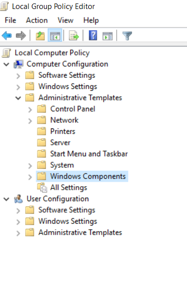
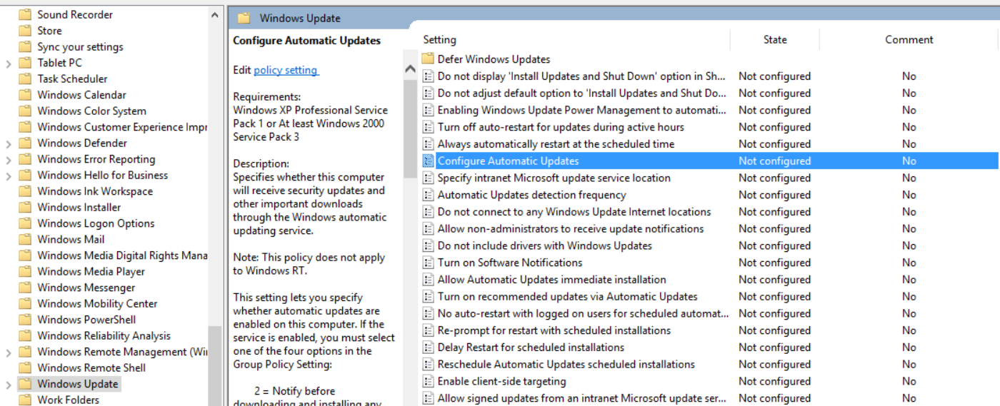
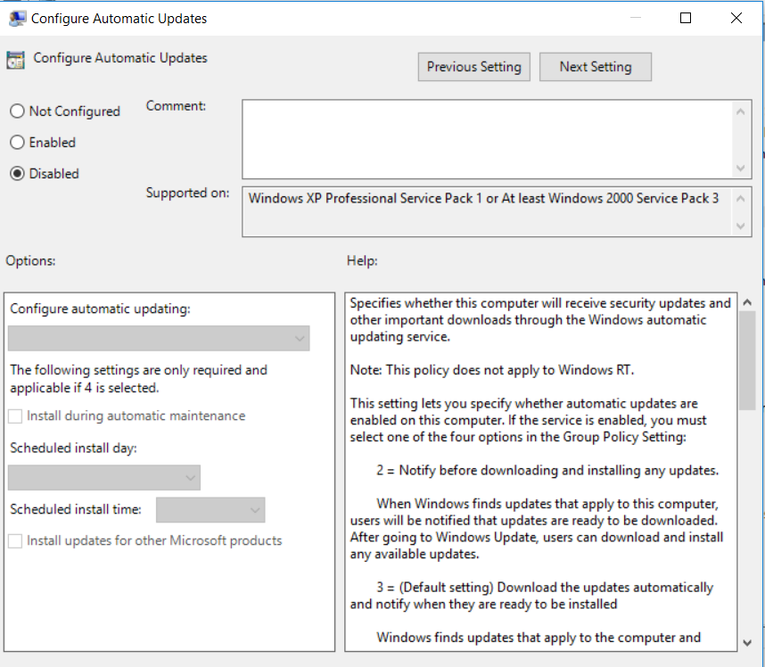

## Disable Updates

### Use one of three methods here:

#### Group Policy Method
* Run gpedit.msc and go to following menu:
   "Computer Configuration" > "Administrative Templates" > "Windows Components" > "Windows Update"
   * "Configure Automatic Updates"
      * Change it to "Disabled"

* Locate Windows Components item

* Locate "Configure Automatic Updates"

* Configure Automatic Updates to "Disabled"

#### Registry Method
* Add new key to the following key:
   * Create following key:
     HKEY_LOCAL_MACHINE\Software\Policies\Microsoft\Windows\WindowsUpdate\AU
     > Add DWORD AUOptions=2
     
#### Disabling Windows Update Service
* Run "services.msc" -> Find "Windows Update" -> Change Startup type to "Disabled" (There are some chances the services will revive)
